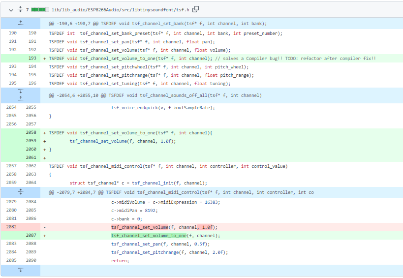

# PRACTICA 7:Buses de comunicación III (I2S)

## Parte 1: Reproducción desde memoria interna
## Codigo:
```cpp
#include "Arduino.h"
#include "FS.h"
#include "HTTPClient.h"
#include "SPIFFS.h"
#include "SD.h"
#include "SPI.h"
#include "AudioGeneratorAAC.h"
#include "AudioOutputI2S.h"
#include "AudioFileSourcePROGMEM.h"
#include "sampleaac.h"

AudioFileSourcePROGMEM *in;
AudioGeneratorAAC *aac;
AudioOutputI2S *out;

void setup(){

  Serial.begin(115200);
  in = new AudioFileSourcePROGMEM(sampleaac, sizeof(sampleaac));
  aac = new AudioGeneratorAAC();
  out = new AudioOutputI2S();
  out -> SetGain(0.125);
  out -> SetPinout(26,25,22);
  aac->begin(in, out);

}

void loop(){

  if (aac->isRunning()) {
    aac->loop();
    } 
  else {
      aac -> stop();
      Serial.printf("Sound Generator\n");
      delay(1000);
  }
}
```
## Corrección de un bug:
Al compilar el codigo, nos salia que habia un error en la linea 2100 de un archivo llamado tsf.h (src/libtinysoundfont/tsf.h:2100:1: error: insn does not satisfy its constraints:)

Buscamos por internet el error y en un foro de Github ( https://github.com/earlephilhower/ESP8266Audio/issues/440 ), encontramos que teniamos que modificar el archivo tsf.h

En el siguiente enlace se muestra las lineas de codigo a eliminar y a añadir (https://github.com/arendst/Tasmota/pull/13483/files )




## Descibir la salida por el puerto serie:
Una vez arreglado el bug, al compilar y ejecutar, podemos ver que muestra por pantalla la frase "Sound generator". También, por el altavoz, se escucha la voz de un hombre hablando (se ve en el video).
 


## Explicar el funcionamiento:
incluimos todas las librerias necesarias para el amplificador "ESP8266Audio":
```cpp
#include "Arduino.h"
#include "FS.h"
#include "HTTPClient.h"
#include "SPIFFS.h"
#include "SD.h"
#include "SPI.h"
#include "AudioGeneratorAAC.h"
#include "AudioOutputI2S.h"
#include "AudioFileSourcePROGMEM.h"
#include "sampleaac.h"

AudioFileSourcePROGMEM *in;
AudioGeneratorAAC *aac;
AudioOutputI2S *out;
```

Dentro del setup, primero de todo inicializamos el serial. Después asignamos asignamos la variable 'in' a "AudioFileSourcePROGMEM(sampleaac, sizeof(sampleaac))" lo cual importa el archivo.
Seguimos asignando "aac = new AudioGeneratorAAC()" para poder decodificar el audio y "out = new AudioOutputI2S()" para la ganancia. En  "out -> SetPinout(26,25,22);" asignamos los pines de salida y en "aac->begin(in, out);" asignamos la entrada y la salida.

```cpp
void setup(){

  Serial.begin(115200);
  in = new AudioFileSourcePROGMEM(sampleaac, sizeof(sampleaac));
  aac = new AudioGeneratorAAC();
  out = new AudioOutputI2S();
  out -> SetGain(0.125);
  out -> SetPinout(26,25,22);
  aac->begin(in, out);

}
```

Ahora en el loop se hace un bucle if que decodifica el acc. Si no se entra en el bucle, se muestra por pantalla "Sound Generator" y se hace un delay.
```cpp
void loop(){

  if (aac->isRunning()) {
    aac->loop();
    } 
  else {
      aac -> stop();
      Serial.printf("Sound Generator\n");
      delay(1000);
  }
}
```