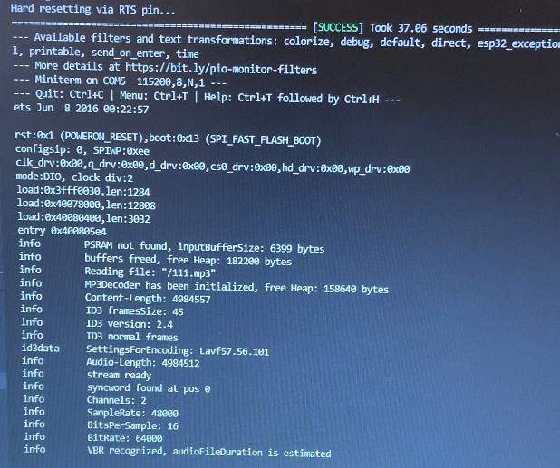

# PRACTICA 7:Buses de comunicación III (I2S)

## Parte 2: reproducir un archivo WAVE en ESP32 desde una tarjeta SD externa

## Codigo:
```cpp
#include <Arduino.h>

#include "WiFi.h"
#include "Audio.h"
#include "SD.h"
#include "FS.h"

// Digital I/O used
#define SD_CS          5
#define SPI_MOSI      23
#define SPI_MISO      19
#define SPI_SCK       18
#define I2S_DOUT      25
#define I2S_BCLK      27
#define I2S_LRC       26

Audio audio;

String ssid = "Xiaomi_11T_Pro";
String password = "f5cbd8a82232";

void setup() {
    pinMode(SD_CS, OUTPUT);      digitalWrite(SD_CS, HIGH);
    SPI.begin(SPI_SCK, SPI_MISO, SPI_MOSI);
    Serial.begin(115200);
    SD.begin(SD_CS);
    WiFi.disconnect();
    WiFi.mode(WIFI_STA);
    WiFi.begin(ssid.c_str(), password.c_str());
    while (WiFi.status() != WL_CONNECTED) delay(1500);
    audio.setPinout(I2S_BCLK, I2S_LRC, I2S_DOUT);
    audio.setVolume(21); // 0...21

   audio.connecttoFS(SD, "/superhyper.wav");
//  audio.connecttohost("http://www.wdr.de/wdrlive/media/einslive.m3u");
//    audio.connecttohost("http://macslons-irish-pub-radio.com/media.asx");
//    audio.connecttohost("http://mp3.ffh.de/radioffh/hqlivestream.aac"); //  128k aac
  //  audio.connecttohost("http://mp3.ffh.de/radioffh/hqlivestream.mp3"); //  128k mp3
//    audio.connecttohost("https://github.com/schreibfaul1/ESP32-audioI2S/raw/master/additional_info/Testfiles/sample1.m4a"); // m4a
// audio.connecttohost("https://github.com/schreibfaul1/ESP32-audioI2S/raw/master/additional_info/Testfiles/test_16bit_stereo.wav"); // wav
//    audio.connecttospeech("Wenn die Hunde schlafen, kann der Wolf gut Schafe stehlen.", "de");
//    audio.connecttospeech(" Introduzca pasta,  y pulse boton para Jugar, perdedor, jajaja.", "es");
}

void loop()
{
    audio.loop();
}

// optional
void audio_info(const char *info){
    Serial.print("info        "); Serial.println(info);
}
void audio_id3data(const char *info){  //id3 metadata
    Serial.print("id3data     ");Serial.println(info);
}
void audio_eof_mp3(const char *info){  //end of file
    Serial.print("eof_mp3     ");Serial.println(info);
}
void audio_showstation(const char *info){
    Serial.print("station     ");Serial.println(info);
}
void audio_showstreamtitle(const char *info){
    Serial.print("streamtitle ");Serial.println(info);
}
void audio_bitrate(const char *info){
    Serial.print("bitrate     ");Serial.println(info);
}
void audio_commercial(const char *info){  //duration in sec
    Serial.print("commercial  ");Serial.println(info);
}
void audio_icyurl(const char *info){  //homepage
    Serial.print("icyurl      ");Serial.println(info);
}
void audio_lasthost(const char *info){  //stream URL played
    Serial.print("lasthost    ");Serial.println(info);
}
void audio_eof_speech(const char *info){
    Serial.print("eof_speech  ");Serial.println(info);
}
```


## Descibir la salida por el puerto serie:

Al compilar y ejecutar el programa, en la parte física se escucha a través del altavoz, el archivo de audio .wav o .mp3 que se encuentra dentro de la SD conectada al lector. En el monitor, se muestra la información de este archivo que se ve en la imágen, por ejemplo el nombre del archivo que esta sonando como Reading file: /111.mp3 (esta captura es del archivo"111.mp3"), la frameSize, Audio-Length, SampleRate, BitsPerSample, BitRate, etc.



## Explicar el funcionamiento:
Este programa sh ha extraido del Github (https://github.com/mlopezpalma/audiowifi)
Primero de todo, tenemos que incluir las librerias necesarias para este proyecto:   

```cpp
#include <Arduino.h>

#include "WiFi.h"
#include "Audio.h"
#include "SD.h"
#include "FS.h"

```

Después se declara que pines de entrada y salida hay que usar para cada puerto de los componentes SD, SPI y I2S. También se crean las variables con el nombre del wifi al que nos vamos a conectar y su contraseña (en nuestro caso, para esta practica, no es del todo necesario, ya que estamos reproduciendo el audio des de un archivo leido de la SD y no des de internet)
```cpp
// Digital I/O used
#define SD_CS          5
#define SPI_MOSI      23
#define SPI_MISO      19
#define SPI_SCK       18
#define I2S_DOUT      25
#define I2S_BCLK      27
#define I2S_LRC       26

Audio audio;

String ssid = "Xiaomi_11T_Pro";
String password = "f5cbd8a82232";
```

Dentro del setup se asocian los pines a los componentes, se hace el begin del SPI, de la SD y del Serial y se connecta al Wifi.
Después, utilizando el "audio.connecttoFS(SD, "/superhyper.wav")", lo que hacemos es indicarle que reproduzca este archivo .wav que se encuentra dentro de la SD. También hay otras instrucciones comentadas que serian para reproducir archivos desde internet o para reproducir el texto especificando el idioma.

```cpp

void setup() {
    pinMode(SD_CS, OUTPUT);      digitalWrite(SD_CS, HIGH);
    SPI.begin(SPI_SCK, SPI_MISO, SPI_MOSI);
    Serial.begin(115200);
    SD.begin(SD_CS);
    WiFi.disconnect();
    WiFi.mode(WIFI_STA);
    WiFi.begin(ssid.c_str(), password.c_str());
    while (WiFi.status() != WL_CONNECTED) delay(1500);
    audio.setPinout(I2S_BCLK, I2S_LRC, I2S_DOUT);
    audio.setVolume(21); // 0...21

   audio.connecttoFS(SD, "/superhyper.wav");
//  audio.connecttohost("http://www.wdr.de/wdrlive/media/einslive.m3u");
//    audio.connecttohost("http://macslons-irish-pub-radio.com/media.asx");
//    audio.connecttohost("http://mp3.ffh.de/radioffh/hqlivestream.aac"); //  128k aac
  //  audio.connecttohost("http://mp3.ffh.de/radioffh/hqlivestream.mp3"); //  128k mp3
//    audio.connecttohost("https://github.com/schreibfaul1/ESP32-audioI2S/raw/master/additional_info/Testfiles/sample1.m4a"); // m4a
// audio.connecttohost("https://github.com/schreibfaul1/ESP32-audioI2S/raw/master/additional_info/Testfiles/test_16bit_stereo.wav"); // wav
//    audio.connecttospeech("Wenn die Hunde schlafen, kann der Wolf gut Schafe stehlen.", "de");
//    audio.connecttospeech(" Introduzca pasta,  y pulse boton para Jugar, perdedor, jajaja.", "es");
}
```

Finalmente en el loop se usa la función 'audio.loop()' para que reproduzca el archivo hasta que termine.
Seguidamente hay una serie de funciones que són para aportar información sobre el archivo que se esta reproduciento.

```cpp
void loop()
{
    audio.loop();
}

// optional
void audio_info(const char *info){
    Serial.print("info        "); Serial.println(info);
}
void audio_id3data(const char *info){  //id3 metadata
    Serial.print("id3data     ");Serial.println(info);
}
void audio_eof_mp3(const char *info){  //end of file
    Serial.print("eof_mp3     ");Serial.println(info);
}
void audio_showstation(const char *info){
    Serial.print("station     ");Serial.println(info);
}
void audio_showstreamtitle(const char *info){
    Serial.print("streamtitle ");Serial.println(info);
}
void audio_bitrate(const char *info){
    Serial.print("bitrate     ");Serial.println(info);
}
void audio_commercial(const char *info){  //duration in sec
    Serial.print("commercial  ");Serial.println(info);
}
void audio_icyurl(const char *info){  //homepage
    Serial.print("icyurl      ");Serial.println(info);
}
void audio_lasthost(const char *info){  //stream URL played
    Serial.print("lasthost    ");Serial.println(info);
}
void audio_eof_speech(const char *info){
    Serial.print("eof_speech  ");Serial.println(info);
}
```